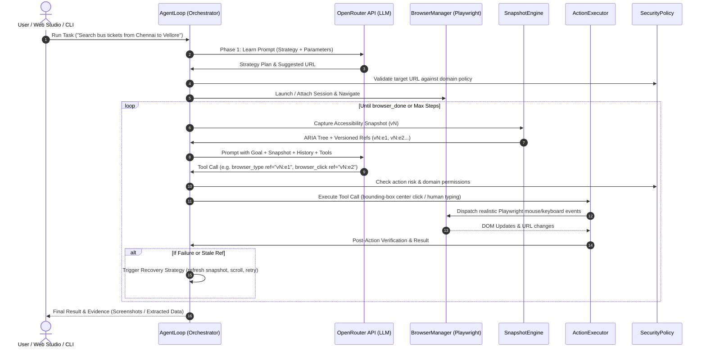

# BrowserAgent: Autonomous LLM-Driven Web Automation Studio

[](https://www.typescriptlang.org/)
[](https://playwright.dev/)
[](https://openrouter.ai/)
[]()
[](LICENSE)
[]()

An enterprise-grade autonomous web automation agent and interactive web studio built upon the specifications in [deep-research-report.md](./deep-research-report.md). BrowserAgent bridges LLMs (via the **OpenRouter API**) with modern browser automation (**Playwright**) using **Semantic Accessibility Snapshots**, **Bounding-Box Coordinate Interactions**, and **Live Viewport Streaming**.

<p align="center">
  
</p>

---

## 🌟 Core Architecture & Key Features

### 1. 🖥 Interactive Web Studio Dashboard
Run the agent in a modern visual dashboard (`npm run ui`) featuring:
- **Live Viewport Streaming:** Real-time JPEG canvas updates (~800ms) with address bar synchronization.
- **Split & Focus Views:** Seamlessly toggle between Split View, Browser Focus, and Agent Chat.
- **Accessibility DOM Inspector:** Live inspection of the semantic ARIA tree as the agent navigates.
- **Task History & Quick Chips:** Persistent `localStorage` history for fast re-runs and one-click execution.
- **Live Model Switcher:** Switch between free models and frontier models on the fly.

### 2. 🧠 Prompt Learning & Strategy Formulation
Before executing browser actions, BrowserAgent engages a **Prompt Learning Phase** (`learn_prompt`). It deconstructs your goal into:
- Core understanding & intent extraction
- Extracted parameters & constraints
- Ordered step-by-step navigation strategy plan
- Suggested entrypoint URL

### 3. 🎯 Semantic Accessibility Snapshots
Instead of passing token-heavy, noisy raw HTML or relying on brittle CSS/XPath selectors, the agent extracts a compact **ARIA Accessibility Tree**. Every interactive element is tagged with a unique, version-scoped reference identifier:
```yaml
PAGE TITLE: "Example Store"
SNAPSHOT VERSION: v1
INTERACTIVE ELEMENTS:
  - textbox "Search query" [ref=v1:e1, placeholder="Search products..."]
  - button "Search" [ref=v1:e2]
  - link "Cart (0)" [ref=v1:e3]
```

### 4. 🖱 Bounding-Box Coordinate Clicks & Humanlike Input
To mimic natural human interactions and avoid synthetic JavaScript event detection:
- Clicks map an element's `ref` to its Playwright locator, compute its actual viewport bounding box, and dispatch real mouse clicks at its center:
  $$\text{clickX} = \text{box.x} + \frac{\text{box.width}}{2}, \quad \text{clickY} = \text{box.y} + \frac{\text{box.height}}{2}$$
- Text typing supports automatic clearing, realistic keystroke intervals, and optional Enter key dispatch.

### 5. 🌐 OpenRouter Multi-Model Support
Natively integrates with OpenRouter (`https://openrouter.ai/api/v1`), supporting both free and premium reasoning models:
- **Free Models (Default):**
  - `deepseek/deepseek-v4-flash-0731:free`
  - `qwen/qwen3.8-27b:free`
  - `google/gemma-4-26b-a4b-it:free`
  - `nex-agi/nex-n2.5-mini:free`
- **Frontier Models:**
  - `anthropic/claude-3.5-sonnet`
  - `openai/gpt-4o` / `openai/gpt-4o-mini`
  - `mistralai/mistral-large`

### 6. 🛡 Self-Healing & Stale Reference Recovery
Web pages are dynamic. BrowserAgent incorporates snapshot versioning (e.g. `v1:e5` $\to$ `v2:e5`):
- **Stale Ref Detection:** Catches references targeted from outdated page states, delivers actionable diagnostics, and requests a fresh snapshot.
- **Anti-Repetition Heuristics:** Detects loops or repeated action failures and injects recovery advice (scrolling, waiting, keyboard fallbacks).
- **Post-Action Verification:** Confirms whether clicks triggered URL transitions, modals, or DOM mutations.

### 7. 🔒 Security & Session Layer
- **Domain Whitelisting (`allowedDomains`):** Restricts navigation to authorized domains or wildcard patterns to prevent SSRF.
- **Credential & Secret Masking:** Automatically redacts Authorization Bearer tokens, API keys, and passwords from logs and prompts.
- **Session Persistence:** Supports `--session <id>` to persist and restore authentication states (cookies and localStorage) across tasks.

### 8. 💻 Desktop Application & Research Note Operations
Beyond browser automation, BrowserAgent operates as a full hybrid **Computer Operator**:
- **`desktop_write_note` (Notepad Scratchpad):** Formats research summaries, discrepancy logs, or audit findings into `data/outputs/` and displays notes to the user.
- **`desktop_launch_app`:** Launches authorized desktop utilities (`notepad`, `calc`, `explorer`).
- **`desktop_reveal_file`:** Opens the desktop file manager (Windows File Explorer) with the generated report or output artifact highlighted.
- **`file_read`:** Safely reads local project data files (JSON, CSV, text) within workspace boundaries to cross-reference data against web portals.
- **`file_list_directory`:** Inspects directories and drives (e.g. `D:\`) to discover local files and folder structures.

### 9. 📁 Content-Aware File Organization & Semantic Folder Renaming
Unlike basic file sorters that only check filename extensions, BrowserAgent features a deep semantic inspection and organization engine:
- **`FileInspector` (Deep Content Sampling):** Reads head/tail snippets, parsed PDF text streams, CSV column headers, and entities to uncover real document intent.
- **`file_organize_smart`:** Intelligently groups files by business topic (`AWS_Invoices`, `Tax_and_Compliance`, `Resumes_and_Careers`, `Healthcare_and_Research`) rather than generic `Documents/` or `Images/` folders.
- **`file_rename_folder_by_content`:** Inspects all documents inside a folder, calculates the dominant topic consensus, and renames the folder on disk to match its actual contents.
- **Transactional Undo Reversibility (`file_undo_organize`):** Emits machine-readable manifests (`data/outputs/organizer-manifest-<timestamp>.json`) with one-click full rollback capability.

### 10. 🎙 100% Offline Active Voice Listening Pipeline (`faster-whisper` `small.en`)
Zero cloud audio latency, 100% local privacy:
- **Dynamic VAD:** Real-time Web Audio API energy analysis with adaptive background noise calibration.
- **Zero Consonant Clipping:** Pre-roll circular audio buffer (768ms) captures speech onset before speech threshold trigger.
- **Persistent Python STT Daemon:** Node controller keeps a pre-warmed `faster-whisper` `small.en` worker in memory via stdin/stdout IPC, achieving near-instantaneous transcription without model cold starts.

### 11. 🛡️ Roadblock & Authentication Diagnosis Engine
When web automation tasks encounter sign-in gates (e.g. Google Forms requiring Google account login, "Sign in to continue", "You need permission", or CAPTCHA challenges), BrowserAgent automatically inspects the page state:
- **Root-Cause Diagnosis:** Flags when tasks cannot proceed due to missing authentication credentials instead of falsely reporting success.
- **Explicit Failure Attribution:** Explains the exact barrier encountered:
  `❌ Task Blocked: Target page requires a signed-in Google account ('Sign in to continue'). The current browser session is unauthenticated, so form fields and permissions are inaccessible.`

### 12. 🌐 Operating with Your Real Signed-In Browser (Google Forms, Gmail, etc.)
By default, Playwright launches a fresh, unauthenticated browser session. To have the agent operate on websites where you are already signed in (like Google Forms, Gmail, or corporate portals), you can use either of the following approaches:

#### Method A: Persistent Chrome Profile (Log In Once, Persist Forever)
Set the environment variable in `.env`:
```env
USE_REAL_CHROME=true
HEADLESS=false
```
1. BrowserAgent launches your real installed Google Chrome with a persistent user data directory (`.sessions/chrome-profile`).
2. Log into your Google account or required website once.
3. Your login session, cookies, and tokens stay saved permanently across all future agent tasks.

#### Method B: Attach Directly to Your Running Chrome (Remote Debugging CDP)
Control your everyday, already-open Chrome window with all active tabs and Google accounts intact:
1. Start Google Chrome with remote debugging enabled:
   - On Windows:
     ```cmd
     chrome.exe --remote-debugging-port=9222 --user-data-dir="C:\ChromeDebugProfile"
     ```
   - On macOS:
     ```bash
     /Applications/Google\ Chrome.app/Contents/MacOS/Google\ Chrome --remote-debugging-port=9222 --user-data-dir="/tmp/chrome-debug"
     ```
2. Set in `.env`:
   ```env
   CHROME_CDP_URL=http://localhost:9222
   ```
3. BrowserAgent connects directly to your active Chrome window via CDP (`chromium.connectOverCDP`), operating on your live tabs with all your logged-in accounts.

---

## 🏗 System Architecture Flow



---

## 🏢 HulChul AI Engineering Assignment: Computer Operator Showcase

This repository contains the complete implementation for the **HulChul AI Engineering Internship Build Assignment**.

Detailed engineering documentation:
- 📄 **[ENGINEERING_NOTE.md](./ENGINEERING_NOTE.md)**: Architectural choices, AI tool disclosures, personal engineering ownership, system limitations, and production roadmap.

### 🌟 Business Scenario: Enterprise Invoice & Expense Reconciliation

The computer operator bridges local business data files (`data/samples/`) with the internal **HulChul Operations ERP Portal** (`http://localhost:3000/app`).

| HulChul Requirement | Demonstrated Scenario | How to Run / Inspect |
|---|---|---|
| **1. Base Working Execution** | Reconciles standard domestic invoices from `data/samples/invoices_standard.json` into the ERP form, generating verified confirmation tokens. | Click quick chip **"Domestic Batch (Scenario A)"** in the studio or run test suite. |
| **2. Task Adaptability (Variation)** | Reconciles international contractor expenses with EUR/GBP currencies and foreign VAT tax exemptions without code changes. | Click quick chip **"International VAT (Variation B)"** or run `npm test`. |
| **3. Meaningful Failure Handling** | Submits a high-value invoice (> $500) missing Tax ID, detects the validation error banner, retrieves fallback Tax ID from backup, and completes filing without duplicate actions. | Click quick chip **"Failure Self-Correction (Scenario C)"**. |
| **4. Verified Completion & Evidence** | Operator independently audits `#records-table`, validates confirmation codes, and generates `data/outputs/reconciliation-report.json` with execution trace. | Generated automatically on completion; view in studio **Data** tab. |
| **5. Human Control & Safety** | Interactive **Pause/Resume** button in studio header, plus an automatic **Supervisor Approval Gate** for high-risk actions (transactions $\ge \$1,000$). | Demonstrated interactively in Studio UI and validated in tests. |

---

## 🚀 Quickstart & Running Instructions

Evaluators and judges can run BrowserAgent via **Docker (Option A)** or via a **Direct Local Installation (Option B)**. Both execution paths are 100% verified and tested end-to-end.

---

### 🐳 Option A: Run with Docker (Recommended — Instant Setup)

The container environment is pinned with **Playwright v1.63.0** on **Ubuntu 24.04 (noble)**, **Node.js**, and pre-installed **Chromium** browser dependencies.

#### 1. One-Command Launch (Docker Compose)
```bash
# Clone the repository
git clone https://github.com/KrishnaJadhav2525/Smart-AI-Assistant.git
cd Smart-AI-Assistant

# Start the Web Dashboard with automated build & pinned environment
docker compose up --build -d
```

#### 2. Alternative: Plain Docker CLI
```bash
# Build image
docker build -t browser-agent .

# Run container on port 3000
docker run -d -p 3000:3000 --name browser-agent browser-agent
```

#### 3. Access the Web Dashboard
Open your browser at:
👉 **[http://localhost:3000](http://localhost:3000)**

- **Check health status:** `docker compose ps` (Shows `(healthy)`)
- **Inspect live logs:** `docker compose logs -f`
- **Stop container:** `docker compose down` (or `docker stop browser-agent`)

---

### 💻 Option B: Non-Docker Fallback (Local Installation)

If Docker is not installed or unavailable on your evaluation machine, you can run BrowserAgent directly on your host operating system (Windows, macOS, Linux).

#### 1. Prerequisites
- **Node.js**: v20+ or v22+ / v24+ ([Download Node.js](https://nodejs.org/))
- **Git**

#### 2. Installation Steps
```bash
# Clone the repository
git clone https://github.com/KrishnaJadhav2525/Smart-AI-Assistant.git
cd Smart-AI-Assistant

# Install dependencies from package-lock.json
npm install

# Install Playwright browser binaries (Chromium)
npx playwright install chromium

# Compile TypeScript to dist
npm run build
```

#### 3. Start the Web Dashboard
```bash
npm start
# (or for development with hot reload: npm run dev)
```

Open your browser at:
👉 **[http://localhost:3000](http://localhost:3000)**

---

### 🔑 Providing Your API Key (For Evaluators & Judges)

Judges have two simple ways to supply their API key:

1. **Directly in the Web Dashboard (Easiest — 2 Clicks):**
   - Click the **Settings icon (`⚙️`)** or the **Model dropdown** in the top navigation bar.
   - Select your provider (**OpenRouter**, **Gemini**, or custom proxy) and paste your API key into the **"API key"** field.
   - It saves instantly to your browser session—no server restart required.
2. **Via `.env` File (Optional for terminal users):**
   ```bash
   cp .env.example .env
   ```
   Add your key in `.env`: `OPENROUTER_API_KEY=your_key_here`.
3. **Free Models & Local LLMs Out of the Box:**
   - Free reasoning models (`DeepSeek V4 Flash:free`, `Qwen 3.8:free`, `Gemma 4:free`) work automatically.
   - Local proxies (such as Ollama or Antigravity on port 8080) can be used with zero API key.

---

### 🧪 Verifying with Automated Tests
Run the entire 43-test automated test suite across all 11 test files:
```bash
npm test
```

---

## 🖥 Launching the Web Studio Dashboard

Launch the visual web dashboard with:

```bash
npm start
# or:
npm run dev
```

Open your browser at:
👉 **`http://localhost:3000`**

<p align="center">
  
</p>

### What You Can Do in the Web Studio:
- 🚀 **Natural Language Task Execution:** Enter any browsing goal with an optional starting URL.
- ⚡ **Quick Action Chips & History:** Preset task shortcuts and persistent `localStorage` history for instant re-runs.
- 🌐 **Live 800ms Viewport Feed:** Real-time visual canvas synchronized with the agent's browser navigation.
- 🧠 **Strategy & Step Inspector:** Review prompt understanding, execution strategy plans, bounding-box click coordinates, and thoughts.
- 🎯 **DOM Accessibility Tree:** Switch to the **DOM** tab to see the compact ARIA tree representation in real time.
- 📊 **Structured Final Answers:** Formatted summaries, source citations, and raw JSON artifacts in the **Data** tab.

---

## 💻 CLI Usage

You can also operate BrowserAgent directly from your terminal.

### Run an Autonomous Task
```bash
# Basic run with automatic strategy formulation
npx tsx bin/agent.ts run "Search for latest AI agent news and summarize top 3 headlines" --url "https://news.ycombinator.com"

# Visible/headed browser window with slow-motion execution
npx tsx bin/agent.ts run "Find the documentation for Playwright locators" --url "https://playwright.dev" --headed --slow-mo 200

# Persistent session storage (cookies/logins preserved)
npx tsx bin/agent.ts run "Check notification inbox" --url "https://github.com" --session my-github-profile

# Restrict agent to specific domain whitelist
npx tsx bin/agent.ts run "Explore articles" --url "https://example.com" --allowed-domains "example.com,*.example.com"

# Capture screenshots at each step
npx tsx bin/agent.ts run "Test checkout flow" --url "https://demo.store.com" --screenshot
```

### Inspect Page Accessibility Snapshot
Inspect the exact ARIA tree representation generated for any website:
```bash
npx tsx bin/agent.ts snapshot https://news.ycombinator.com
```

---

## 🛠 Programmatic SDK Usage

Embed BrowserAgent directly into your TypeScript/Node.js microservices or workflows:

```typescript
import {
  BrowserManager,
  OpenRouterClient,
  SecurityPolicy,
  AgentLoop,
} from './src/index.js';

async function main() {
  const browserManager = new BrowserManager({
    headless: true,
    sessionId: 'session-demo',
  });

  const openRouterClient = new OpenRouterClient({
    apiKey: process.env.OPENROUTER_API_KEY,
    model: 'deepseek/deepseek-v4-flash-0731:free',
  });

  const securityPolicy = new SecurityPolicy({
    allowedDomains: ['wikipedia.org', '*.wikipedia.org'],
  });

  const agent = new AgentLoop(browserManager, openRouterClient, securityPolicy);

  try {
    const result = await agent.run({
      goal: 'Find who created JavaScript and in what year',
      initialUrl: 'https://en.wikipedia.org/wiki/JavaScript',
      maxSteps: 10,
      onStep: (step) => {
        console.log(`[Step ${step.stepNumber}] ${step.toolName}: ${step.output}`);
      },
    });

    console.log('Result:', result.finalAnswer);
    console.log('Total Tokens Used:', result.totalTokens);
  } finally {
    await browserManager.close();
  }
}

main();
```

---

## 🧪 Testing & Validation

BrowserAgent is fully tested with unit and end-to-end integration test suites:
- **`tests/SecurityPolicy.test.ts`**: Tests domain whitelisting, SSRF protections, dangerous tool execution blocks, and credential masking.
- **`tests/SnapshotEngine.test.ts`**: Verifies semantic ARIA tree generation, versioned reference assignment, and element deduplication.
- **`tests/ActionExecutor.test.ts`**: Tests bounding-box coordinate calculations, typing, batch form filling, and DOM verification.
- **`tests/AgentIntegration.test.ts`**: Full autonomous multi-step browser agent loop running against local mock HTML fixtures.

Run all tests:
```bash
npm test
```

Strict TypeScript check:
```bash
npm run typecheck
```

---

## ⚡ Frontier Intelligence: Why Adding a Paid API Key Makes the Assistant Much Smarter

By default, BrowserAgent ships with free models (`DeepSeek V4 Flash:free`, `Qwen 3.8:free`, `Gemma 4:free`) so any evaluator can run and test the complete system out-of-the-box without spending a dime.

However, plugging in a **paid API key** (such as **Claude 3.5 Sonnet / 3.7 Sonnet**, **GPT-4o**, or **Gemini 2.5 Pro**) elevates this assistant to a significantly higher tier of capability:

1. **Long-Horizon Multi-Step Planning (25+ Steps Without Drifting):**
   - Free models are susceptible to context degradation or goal loss after 5-8 steps on complex websites.
   - Frontier models maintain a crisp, persistent chain-of-thought, easily carrying multi-step dependencies across dozens of pages, nested forms, and dynamic SPAs.
2. **Deep Semantic Grounding & Ambiguity Resolution:**
   - On messy, poorly labeled real-world websites where elements lack proper ARIA labels, frontier models possess superior zero-shot world knowledge to infer element purpose from surrounding layout, text proximity, and iconography.
3. **Flawless Complex Form & Table Comprehension:**
   - Enterprise tax portals, complex invoice reconciliations, and dynamic filtering tables require nuanced schema mapping. Paid models demonstrate near-zero hallucination on input field constraints and format validation.
4. **Superior Self-Healing & Error Recovery:**
   - When encountering roadblocks, unexpected popups, or network hiccups, paid models generate sophisticated recovery strategies (re-inspecting snapshots, backtracking, adjusting scroll offsets) rather than prematurely quitting.
5. **No Rate Limits, No Throttling, Instant Speed:**
   - Free-tier community models on OpenRouter occasionally suffer from high traffic queues, token throttling, or temporary 429 rate limits. A paid key grants dedicated high-throughput concurrency and sub-second reasoning speeds.

*How to enable:* Simply click **Settings (`⚙️`)** in the dashboard and paste your OpenRouter or Gemini API key. It applies instantly.

---

## 🔮 Future Roadmap & What Can Be Improved

While BrowserAgent is already a fully capable autonomous computer operator, several architectural and functional enhancements can take it even further:

1. **Full Bi-directional Voice Mode (Real-Time Audio In/Out):**
   - *Current state:* Live speech-to-text transcription via Web Speech API and faster-whisper (`small.en`).
   - *Improvement:* Integrate a sub-150ms text-to-speech engine (e.g. Kokoro-82M or ElevenLabs streaming) so the agent narrates its actions in real time and can verbally ask for clarifications like a human copilot.
2. **Native OS-Level Computer Vision Control (Desktop Screen Operations):**
   - *Current state:* Launches and controls native desktop applications via protocol commands (`microsoft.windows.camera:`, `calc`, `notepad`, `explorer`) and file operations.
   - *Improvement:* Integrate native OS accessibility buses (Windows UI Automation, macOS AXUIElement) combined with visual grounding models (e.g. OS-World / Computer Use API) to click and type into arbitrary third-party desktop software like Excel, Slack, or Photoshop.
3. **Hierarchical Multi-Agent Swarms (Parallel Worker Sub-Agents):**
   - *Current state:* Single sequential agent loop per chat session.
   - *Improvement:* Allow a primary Orchestrator Agent to spawn parallel ephemeral worker agents (e.g. scraping 5 competitor flight websites simultaneously in separate background tabs and aggregating results into one unified table).
4. **Self-Healing DOM Embedding Memory & Learned Skills:**
   - *Current state:* Fresh snapshot inspection per turn.
   - *Improvement:* Store vector embeddings of interactive elements. If a recurring site undergoes a minor UI redesign, the agent recognizes elements by semantic similarity without needing re-prompting.
5. **Browser Extension Companion (Zero-Playwright Inline Control):**
   - *Current state:* Automation via Playwright Chromium or CDP attachment.
   - *Improvement:* Package the UI as a Chrome MV3 Extension that directly manipulates existing browser tabs without needing any external Node or Playwright process.

---

## 📜 Tool Schema Reference

| Tool Name | Parameters | Description |
|---|---|---|
| `browser_navigate` | `url: string` | Safely navigates to a URL. |
| `browser_click` | `ref: string, button?: string, clickCount?: number` | Clicks element at bounding box center coordinates. |
| `browser_type` | `ref: string, text: string, clear?: boolean, pressEnter?: boolean` | Types text into input field with realistic keystrokes. |
| `browser_fill_form` | `fields: Array<{ ref: string, value: string }>` | Fills multiple form fields in one atomic batch. |
| `browser_hover` | `ref: string` | Hovers mouse over element center coordinates. |
| `browser_press_key` | `key: string` | Presses keyboard key (e.g. `Enter`, `Tab`, `Escape`). |
| `browser_select_option` | `ref: string, value: string` | Selects dropdown combobox option. |
| `browser_wait_for` | `ms?: number, text?: string` | Waits for a time duration or for visible text to appear. |
| `browser_snapshot` | *none* | Forces an immediate fresh accessibility snapshot. |
| `browser_done` | `summary: string, finalAnswer: string, sources?: string[]` | Concludes task with structured final answer. |

---

## 🎨 Design System

BrowserAgent's Web Studio follows the token-driven **ChatGPT Design System** for all studio and web interfaces. See [docs/DESIGN_SYSTEM.md](./docs/DESIGN_SYSTEM.md) for full token tables, color palette, component density, typography, accessibility rules, and Definition of Done.

---

## 📄 License

MIT License. See [LICENSE](./LICENSE) for details. 
